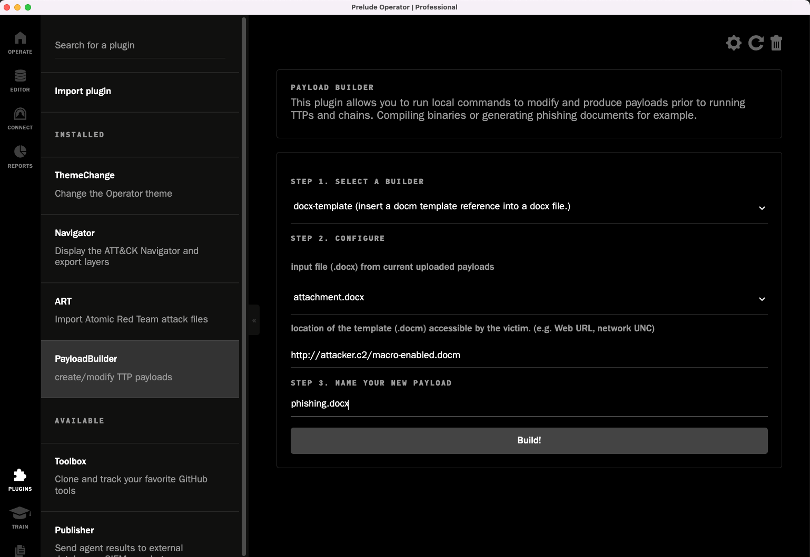

PayloadBuilder
==============

### A plugin for [Prelude Operator](https://github.com/preludeorg/operator-support)

This plugin allows users to create/modify TTP payloads from directly within the Prelude Operator interface. Users simply select a builder, enter the payload configuration, and click "Build". It is also extensible, allowing users to add additional builder definitions.



### Builder Definition

Builder Definitions are javascript objects with the following keys.

| key         | type  | Description                                    |
| ----------- | ----- | ---------------------------------------------- |
| name        | str   | unique id for referencing and user selection   |
| description | str   | short explanation of what the builder produces |
| args        | [*arg*] | Array of [Argument Definitions](#argument-definitions)                |
| executor    | fn    | Javascript function which receives user entered values for args, and returns the payload as a string or buffer which will be saved in payloads/uploads.

### Argument Definitions

Argument Definitions are used to dynamically generate user input forms to gather payload configuration data before passing them to the executor function.

| key         | type | Description |
| ----------- | ---- | ----------- |
| name        | str  | unique name used for referencing |
| label       | str  | description displayed to the user |
| type        | str  | user input type (list, string) |
| choices     | fn \| [[id, value], ...] | Javascript function which returns an array of Array of id/value pairs, or the Array of id/value pairs directly.


### Builder Definition Example
docx template example - adds/updates a reference to an external template resource.

```javascript
{
    name: 'docx-template',
    description: 'insert a docm template reference into a docx file.',
    args: [
        {
            name: 'docx',
            label: 'input file (.docx) from current uploaded payloads',
            type: 'list',
            choices: () => {
                return getPayloads().then(payloads => 
                    payloads.map(payload => [path.parse(payload).base, payload])
                )
            }
        },
        {
            name: 'template',
            label: 'location of the template (.docm) accessible by the victim. (e.g. Web URL, network UNC)',
            type: 'string'
        }
    ],
    executor: ({ docx, template }) => {
        return updateDocxTemplate(docx, template);
    }
}
```